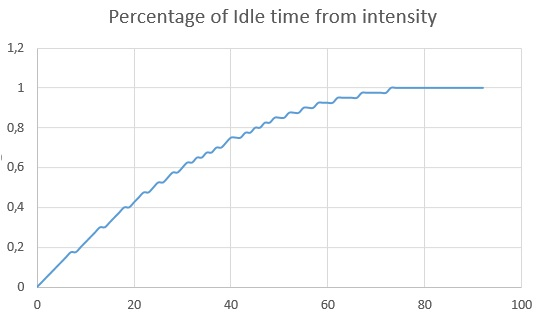

# FIFO-Priority-Task-Planner

## Owerview
A Task planner that is based on First in - First Out principle, augmented with usage of priorities. It gives the opportunity to organize tasks in a more flexible way.
## Data Structures
### PlannerTask
Represents a task to be executed. Contains all the information necessary for execution and planning, such as Excution time (property `Time`), Title of the task (property `Name`),
Priority of the task(property `Priority`). None of the properties can be changed aftyer the instance of class is created.
### FIFOPriorityContainer
Contains dictonry of hashtables of queues for tasks of each priority. The maximum number of priorities is defined in the constructor and can't be changed on the go.
#### Methods 
- `void AddTask(PlannerTask task)` - adds a task at the end of a Dictonary's queue that serves for the same priority as the task.
- `PlannerTask EjectTask(PlannerTask task)` - deques the task from the queue with the smallest priority. (smaller means - more important). Returns 0 if there're no tasks left. Throws a subscribable event `OnElementRemoved` that is used for building Ghant Diagram.
- `void DisplayEnqued()` - displays all the tasks that had previously been put to the dictonary in the ejection order. 
### Planner
Executes the tasks form `FIFOPriorityContainer` in the order the container gives ones out. To get tasks `PlannerTask EjectTask(PlannerTask task)` method used untill it returns 0, meaning all the tasks are fullfilled.
### Methods
- `void StartExecution()` - iniciates the sequential execution of every task one aster another untill thete are no tasks left. It executes the task by making the thread wait for the amount of time that is stated in the task's property `Time`.
### GanttDiagramBuilder
Builds Gant diagram of the execution of the tasks that were put in a particular `FIFOPriorityContainer`.
### Methods
- `void ProcessNextTaskExecution(PlannerTask task)` - Method that accomplishes the task of building the diagram by subscribing for `FIFOPriorityContainer`'s event `OnElementRemoved` and adding time spent in queue of each new element ejected from container.
- `string ToString()` - displays the while diagram on the console.
- `class ProcessedTask` - class that is used by the builder to represent a task that has been removed from Container. it contains information on how long the Task was waiting in the queue to get executed(property `TimeInQueue`).
## Algorythm Description
- `FIFOPriorityContainer` created, with a maximum priority set in the constructor.
- Tasks Added to the container.
- `Planner` created with the `FIFOPriorityContainer` passed to it's constructor.
- `GanttDiagramBuilder` created and subscribed to the Container's `OnElementRemoved` event.
- `Planner` execution started.
- Gantt Diagram Displayed
## Code Demo
### Example of code

### Console Output

### Graphs

The graph shows the dependency of percentage of idle time of the executor depending on the intensity(the amount of time between the new requests arrival). From the graph we can deduce that the less frequently the new requests come to out tasks performer, the more Idle time it has. That is caused by the fact that the performer manages to fullfill bigger part of the tasks when new ones come less frequently.

The following graph shows how average waiting time of a task changes from the priority of the task. As we can see there's a strong upward trend on the graph. This tendency is caused by the fact that Tasks that have a big priority are always the last ones to start execution so they spend more time in the queue. This is effective if we know what tasks need to be executed immediately and what tasks can wait, so we set the most important priority to the tasks that can't wait, and they'll be executed soon.

This graph shows the dependency between the average time of a task in a queue and the intensity of new tasks comming. Taking into ackount the previous graphs we can say that if the new task come very often the Task Performer is unable to do them all fast because he doesn't have enough time: new requests come faster than they can be fullfiled.
